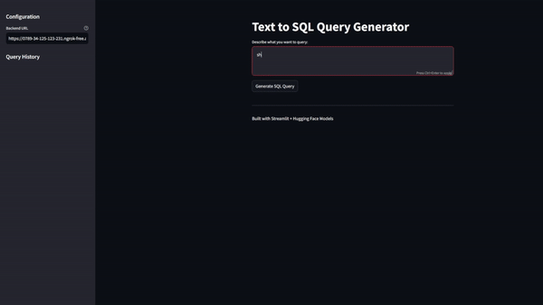

# Text-to-SQL Generator 🔍

This project provides a natural language to SQL query converter using LLaMA 2 and Streamlit. Users can describe their query in plain English, and the system will generate the corresponding SQL query.



## Quick Demo
Check out the demo.gif to see the application in action!

## Setup Instructions

### Prerequisites
- A Google account (for Google Colab)
- Python 3.8 or higher (if running locally)
- HuggingFace account with access to LLaMA 2 models
- ngrok account (free)

### Step 1: Backend Setup (Using Google Colab)
1. Open `TextToSQLQuery.ipynb` in Google Colab
2. Make sure you select a GPU runtime:
   - Runtime → Change runtime type → Hardware accelerator → GPU
3. Get your HuggingFace token:
   - Go to [HuggingFace](https://huggingface.co/)
   - Settings → Access Tokens → New Token
   - Replace `YOUR_HUGGING_FACE_TOKEN` in the notebook with your token
4. Get your ngrok token:
   - Sign up at [ngrok](https://ngrok.com/)
   - Go to [your auth token](https://dashboard.ngrok.com/get-started/your-authtoken)
   - Replace `YOUR_NGROK_TOKEN` in the notebook with your token
5. Run all cells in the notebook
6. Copy the ngrok URL that appears (it will look like `https://xxxx-xx-xxx-xxx-xxx.ngrok-free.app`)

### Step 2: Frontend Setup (Local)
1. Create a new Python file `app.py` and copy the frontend code
2. Install required packages:
   ```bash
   pip install streamlit requests
   ```
3. Run the Streamlit app:
   ```bash
   streamlit run app.py
   ```
4. Paste your ngrok URL from Step 1 into the "Backend URL" field in the sidebar

## Usage
1. Enter your query in natural language (e.g., "Show me all users who signed up in the last 30 days")
2. Click "Generate SQL Query"
3. The generated SQL query will appear below
4. Use the "Copy to clipboard" button to copy the query
5. Previous queries are saved in the sidebar history

## Important Notes
- The backend URL (ngrok) changes every time you restart the Colab notebook
- The free version of ngrok has some limitations
- The notebook must keep running to process queries
- Google Colab sessions have time limits and will disconnect after a period of inactivity

## Troubleshooting

### Common Issues
1. "Error connecting to backend"
   - Check if your Colab notebook is still running
   - Verify the ngrok URL is correct and updated
   - Make sure you have an active internet connection

2. "GPU not detected"
   - Ensure you selected GPU runtime in Colab
   - Try restarting the runtime

3. "Model loading takes too long"
   - This is normal for the first load
   - Subsequent queries will be faster due to caching

4. "Out of memory errors"
   - Restart the Colab runtime
   - Clear the output of cells you're not using

### Tips
- Keep the Colab tab open to prevent disconnections
- If queries become slow, try restarting the runtime
- Clear the browser cache if the frontend becomes unresponsive

## Limitations
- Sessions are temporary (requires restart when Colab disconnects)
- Processing time varies based on GPU availability
- Query generation quality depends on the input clarity
- Some complex SQL queries might need manual adjustment

## Project Structure
```
├── TextToSQLQuery.ipynb    # Backend Colab notebook
├── app.py                  # Frontend Streamlit app
└── demo.gif               # Demo of the application
```

## Credits
- Built with [Streamlit](https://streamlit.io/)
- Uses [LLaMA 2](https://huggingface.co/meta-llama/Llama-2-7b-chat-hf) from Meta
- Powered by [Hugging Face](https://huggingface.co/) models

## License
This project is open source and available under the MIT License.
